# NOIR SETUP

## Current issues v1.3

- More informative console has conflict with E-UI, solution: MIC is disabled by default, you can activate it anytime though, if you want to use its functionality over the E-UI.
- NECR scripts trigger the first time you equip a crossbow, it is desirable to do this outside of combat. Some user reported a crash when he picked a crossbow and tried to equip it in a heavy loaded cell inside combat. To avoid this situation, the first time you ever equip your crossbow, don't do it in combat.
- To avoid save corruption and crashes due to wrong save states, follow the MCM configuration for SSSO below.
- [Cinematic Dragon Soul Absorption](https://www.nexusmods.com/skyrimspecialedition/mods/12106?) was installed with a female voice, if you play a male character, reinstall the mod following [Lexy's guide instructions](https://wiki.nexusmods.com/index.php/User:Darkladylexy/ModList_Page#[Cinematic_Dragon_Soul_Absorption]).

## MO2 Setup

1. Open ModOrganizer and select a profile you want to use as your basis
1. To Launch the game select SKSE in MO2 and hit launch, there you can also create MO2 shortcuts to automatically launch linked binaries trough MO2.
1. Your MO2 Setup is now ready to start modding/ playing the NOIR experience.

### *In case you messed up the modlist default order*

1. Click here  And restore the lastest backup made by me for every Profile you may be using 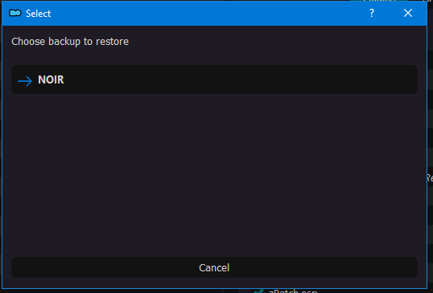
1. This is to have the list sorted in the way it was intended by me.

## Experience XP System (optional)

If you want to [Experience](https://www.nexusmods.com/skyrimspecialedition/mods/17751) a different progression system, enable these three mods in MO2:

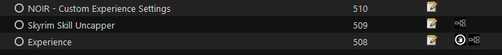

If you want the default Skyrim/Requiem experience system, disable them.

- In Summary, you won’t level up for skill, but for quests, exploration and killing.
- I buffed the grinding skills (Alchemy, Smithing, Enchanting) at low level because I found them boring to level up.
- Also, I buffed the Restoration and Enchanting Schools at low level but not that much as the grinding.

Check the tweaks I made in the .ini files for these mods.

### Optional plugins

- In the righ pane, plugins that are located after Requiem for the Indiferent are optional and can be disabled if desired. Also Some Optional Mods have their own section at the end of the modlist order:
  

## In-Game MCM Options

After starting a new game, you will spawn in the LAL cell. You’ll find a key to the shelves on a table, with basic loadout necessities. Wait until the text in the top left is finished loading all of your mods, then press Esc and go to your MCM settings.

Notes indicate settings to change, if not specified leave as default, also be aware these are my personal settings, I have copied them from Lexy’s, TSO, NOISE, Lotus and STEP guides. So you can choose your owns.

### A Matter Of Time

**Presets**

Auto config: Presets -> Load User Settings

**Display**

Symbol 1

- Scale - 60%

In-Game Clock

- Scale - 60%
- Vertical Offset - 50

In-Game Date

- Scale - 60%
- Horizontal Offset - 10
- Vertical Offset - 60

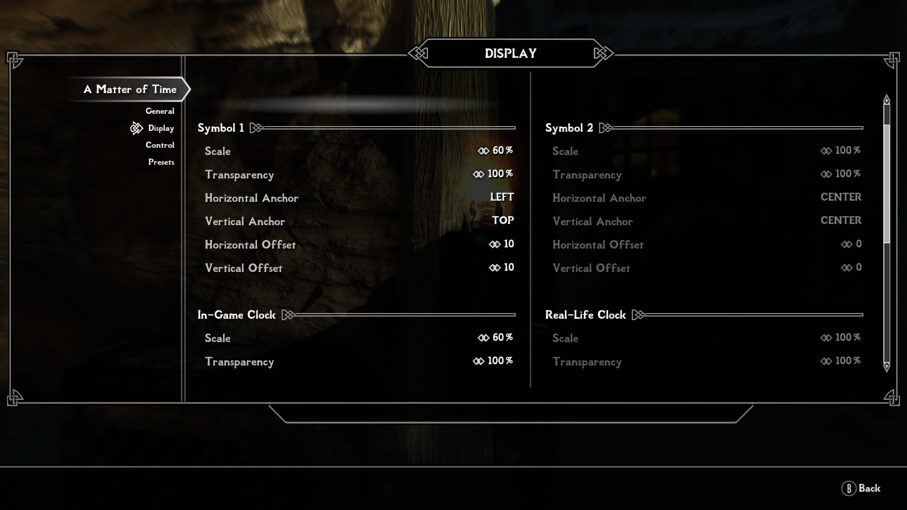

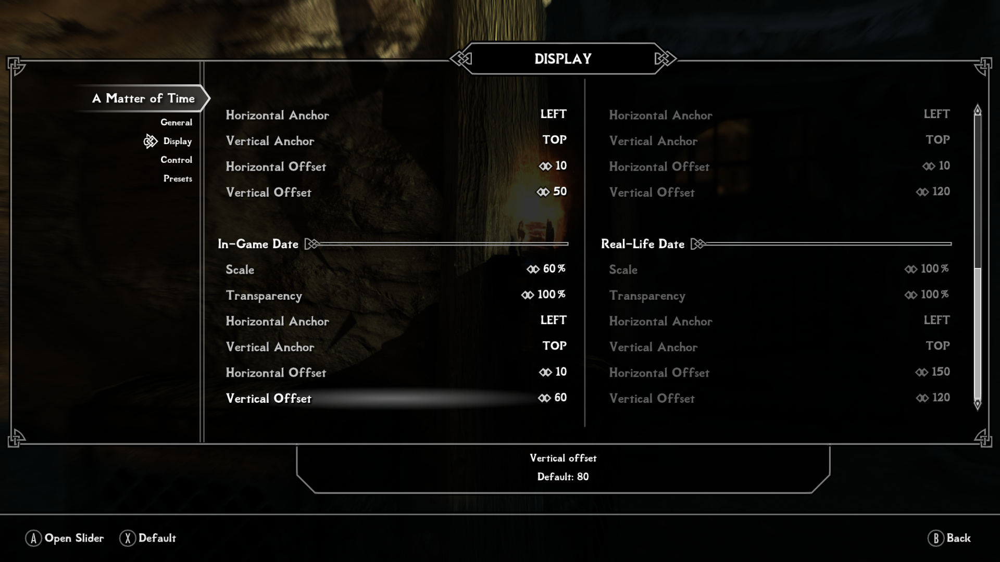

### Blocksteal Redux

- Activate - Enable

- Load Basket - Enable (Respond yes when prompted)

### Equipment HUD

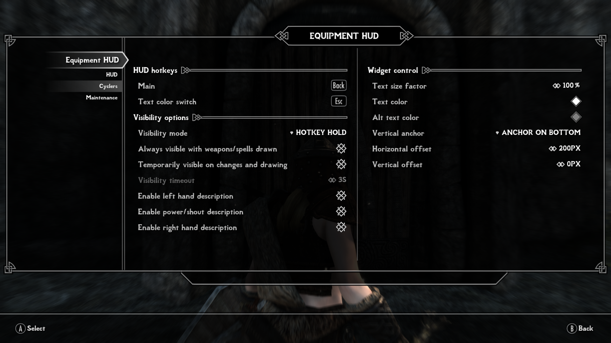

### ESF Companions

**Presets**
Hit apply preset (24 Quest Reasonable)

**Joining**

- Thieves Guild Members Can Join: Enabled

**Quest Tweaks**

- Radiant Quest Reward Gold
- Use Default Gold Rewards: Disabled
- Gold per Guild Rank: 100
- Gold per Player Level: 0
- Gold per Quest Difficulty Level: 100

**Miscellaneous**

- Beast Blood
- Aela Will Offer: Unlimited

### Follower Framework

**Activity**

Sandboxing:

- Only Sandbox in Town - Enabled

Movement

- Catch Up Teleport - Disabled

Stealth:

- Extinguish Torches X

Mounts

- Mount Support - Riding Support Only

### Honed Metal

**General**

- Untick ‘Lore Based Smithing’

- Untick ‘NPCs Have Materials’

- Tempering Cost Multiplier: 0.30

- Enchanting Cost Multiplier: 0.30

- Recharge Cost Multiplier: 0.10

- Crafting Time: 0.25

- Enchanting Time: 0.25

### Immersive HUD

**Activation**

Compass Activation

- Key press toggles - Enabled

- Disable Stealth

### MoreHud SE

**Enemy's Level**

General

- Show Enemy Level - DISABLED

### NECR

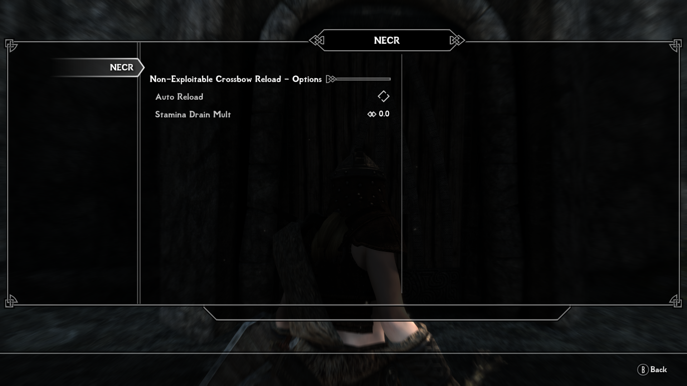

### Not So Fast MG (Not So Fast Mage Guild)

Minimum Days Before Events

- Saarthal Expedition - 3
- Psijic Monk Visit - 7
- Brelyna's Practice - 4
- J'Zargo's Experiment - 4
- Onmund's Request - 4

### Not So Fast MQ (Not So Fast Main Quest)

Minimum Days Before Events

- First Dragon Sighting - 3
- Note From Delphine - 6

OTHER

- No Negotiations - Enabled

### Predator Vision

Settings

- Nightvision Brightness - 50%
- Nightvision Color - 30%
- Predator Vision Brightness - 50%
- Predator Vision Color - 70%

Activation Sounds

- Nightvision - Sound 1
- Predator Vision - Sound 2

Options

- Werewolves get Predator Vision as humans - Enabled

### Quick Light

- Brightness - Bright

### Smart Training

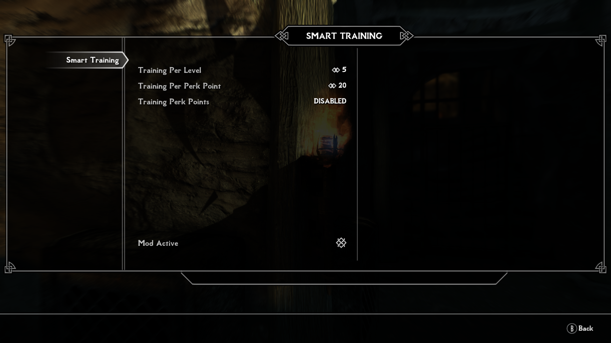

### SSSO

**VERY IMPORTANT:** Assign a *Manual Save Key* and from now on use it to save your game (don't use the menu anymore).

*Rotating Automatic Save* - `Enabled`

*Auto Save Count* - `7 Slots`

*Delay Before Exit Game* - `7 Seconds` (might be set higher if you have a slow drive)

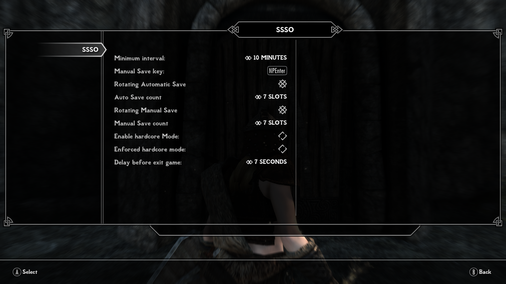

### Timing is Everything

*Presets*

- Load Preset (it should load the values below)

*DLC Quests → Dawnguard*

- Enabled Vampire Attacks: Enabled
- Vampire Attacks: 30
- Dawnguard Recruitment: 30
- Disgused Vampire Change: 30
- Scouting Party Chance: 35
- Eclipse Attack Chance: 0
- Min Days Between Attacks: 5
- Max Days Between Attacks: 20

*DLC Quests → Hearthfire*

- Minimum Level: 20

*DLC → Dragonborn*

- After The Horn of Jurgen Windcaller
- Minimum Level: 50
- Cultist Attack Chance: 25

*Other Quests → Daedric Quest*

- The Cursed Tribe: 25
- The Break of Dawn: 45
- The Break of Dawn: No Vampires: Enabled
- A Night to Remember: 30
- Discerning the Transmundane: 60
- The Whispering Door: 40
- Pieces of The Past: 35
- Boethiah’s Calling: 40

*Other Quests → Misc Quest*

- The Wolf Queen Awakened: 47
- Unfathomable Depths: 32
- Grimsever’s Return: 32
- Kill The Giant: 22
- Dungeon Delving: 30
- Kill the Vampire: 30
- Deathbrand: 36
- Ebony Warrior: 75

*Extra Options → World Encounters*

- Werewolf Encounters: Enabled
- Thalmor Squard: Min Level: 10
- Hired Thugs: Stolen Item Value: 300
- Hired Assassin Min Level: 15
- Hired Assaults:0
- Hired Assassin: Murders: 0
- Bound Collector: Required Bounty: 1500
- Bounty Collector Chance: 25
- Letter from a Friend: Disabled

*Extra Options → Dragon Attacks*

- Min Days Between Attacks: 3
- Dragon Attack Chance: 100

### Thieves Guild Requiements

*Requirements to Begin Recruitment Quest:*

- Items Stolen: 100

### VioLens

**Melee & Ranged**

Melee

- Camera View - 3RD PERSON LAST
- Last Enemy Restriction - Enabled
- Player Killmove Immunity - Enabled

Ranged

- Camera View - PROJECTILES
- Last Enemy Restriction - Enabled

**Stealth & Triggers**

Triggers

- Left Attacks - Enabled
- Alt Werewolf Attacks - Enabled

### Wildcat Combat

Dynamic Combat

- Disable Dynamic Combat - ENABLED

Attacks of Opportunity

- Disable Penanlites vs. Massive Targets - ENABLED

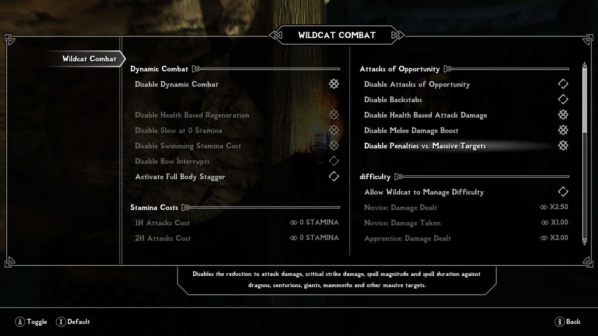

### SKYUI

**Advanced**

- Disable all SWF Version Checking

### Realistic Water 2

- Kynesgrove X - Enabled

- Rorikstead X - Enabled

All other MCM settings can be configured as you like, or depending on extra mods you’ve installed.

**-----Save your game now, open your inventory and close it.-----**

### Requiem (wait until Requiem tells you it is ready)

**Combat**

- No non-hostile Bull Rush/Trample: Enabled
- Fearless and Steadfast enemies: Enabled

**Atmosphere**
- Dragon random spawn interval: 6 days
- Heartbeat threshold: 5%
- Cleared cell respawn time: 90 days
- Fast Travel Allowed: Enabled (Personal Preference)
- Slower Horses: Enabled

**Compatibility & Debug**

- Disable Non-Critical Warnings: Enabled

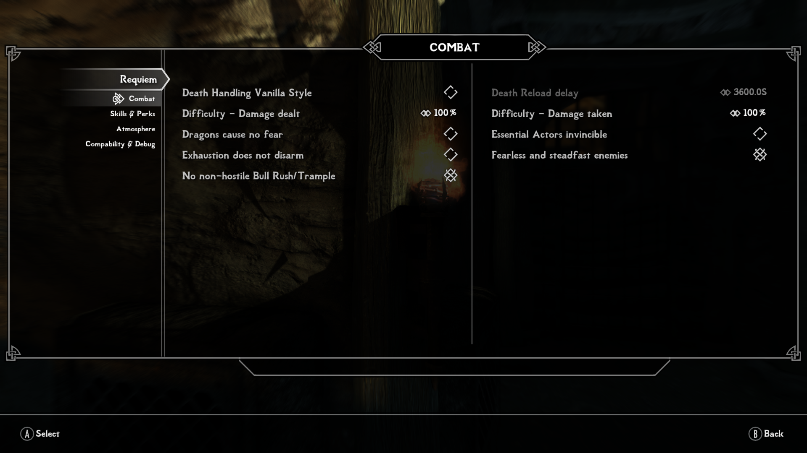

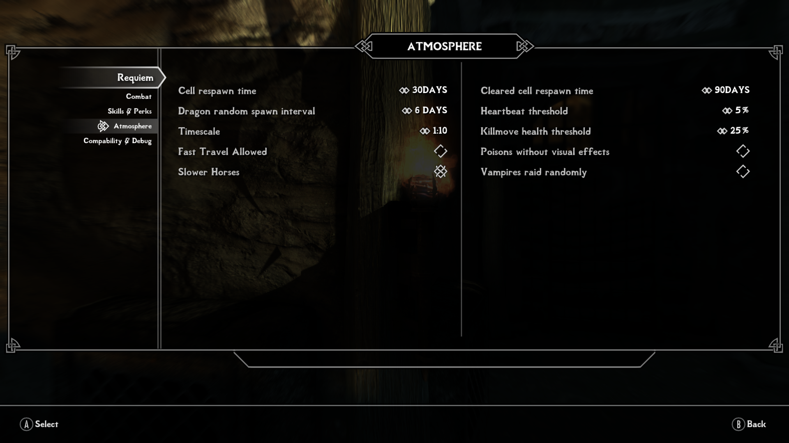

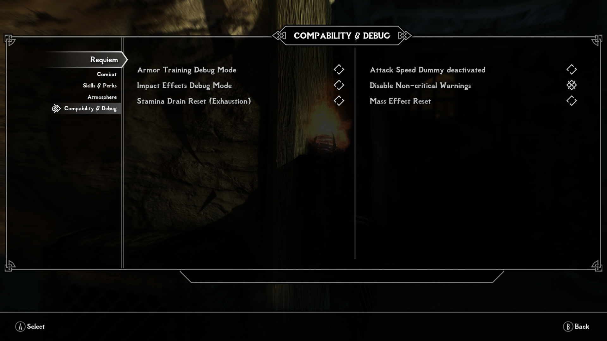
